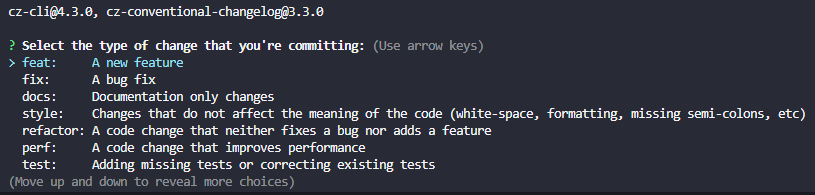

# ServerlessChallengeFrontend

[Description](#description) | [Installation](#installation) | [Git Steps](#git-steps) | [Installation](#installation) | [Development server](#development-serverp) | [Code scaffolding](#code-scaffolding) | [Build](#build) | [Possible next steps](#possible-next-steps)

## Description

This project was generated with [Angular CLI](https://github.com/angular/angular-cli) version 17.2.1, here we can see all registered employees, create, update, and delete employee records.

## Installation

```bash
$ npm install
```
add backend url in baseURL - path src/app/api/baseURL.ts
 
## Git Steps

```bash
$ git add (. or file)
```

The system uses git hooks (husky, [conventional commits](https://www.conventionalcommits.org/en/v1.0.0/)) for commit standardization, so please use the following command

```bash
$ npm run commit
```

Choose one of these options and proceed to the end of the process: 




## Development server

Run `ng serve` for a dev server. Navigate to `http://localhost:4200/`. The application will automatically reload if you change any of the source files.

## Code scaffolding

Run `ng generate component component-name` to generate a new component. You can also use `ng generate directive|pipe|service|class|guard|interface|enum|module`.

## Build

Run `ng build` to build the project. The build artifacts will be stored in the `dist/` directory.

## Possible next steps

Create an environment variables folder <br>
improve background image styling by overlaying an SVG behind the image <br>
if the backend supports it;
create a login screen that separates the view for regular employees and administrator employees, where regular employees can only modify their own records<br> create a registration screen for administrators.